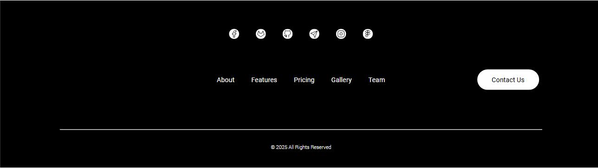

# Footer Gradient 🌐

Este proyecto presenta un footer enfocado principalmente para que destaquen las redes sociales.

---

<div align="center">
  
</div>


---

## Tecnologías Utilizadas ⚙️

- [](src/index.html)
- [](src/style.css/)


## Cómo Empezar 🚀

Sigue estos pasos para configurar y ejecutar el proyecto en tu entorno local:

1. **Clona el repositorio**:
   ```bash
   git clone https://github.com/tu-usuario/footer-social.git
   ```

2. **Navega al directorio del proyecto**:
   ```bash
   cd footer-social
   ```

3. **Instala las dependencias** (asegúrate de tener Node.js instalado):
   ```bash
   npm install
   ```

4. **Inicia el servidor de desarrollo**:
   ```bash
   npm run dev
   ```

5. **Abre tu navegador** y visita `http://localhost:3000`.


## Contribuciones 🤝

Las contribuciones son bienvenidas. Para problemas, ideas o nuevas características, por favor abre un issue o un pull request.

## Contacto 📫

¿Necesitas un diseño web personalizado? Contáctame:

[](mailto:israelcolladom@gmail.com)

## Licencia 📜

Este proyecto está bajo la licencia [MIT](LICENSE).